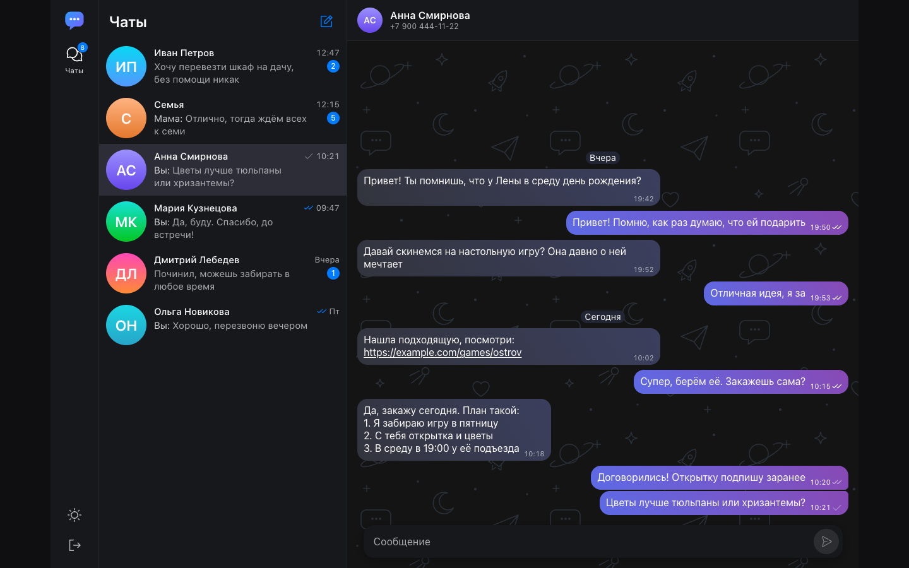
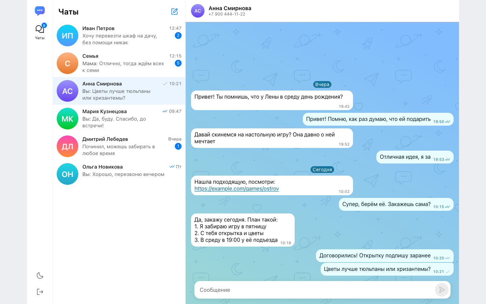
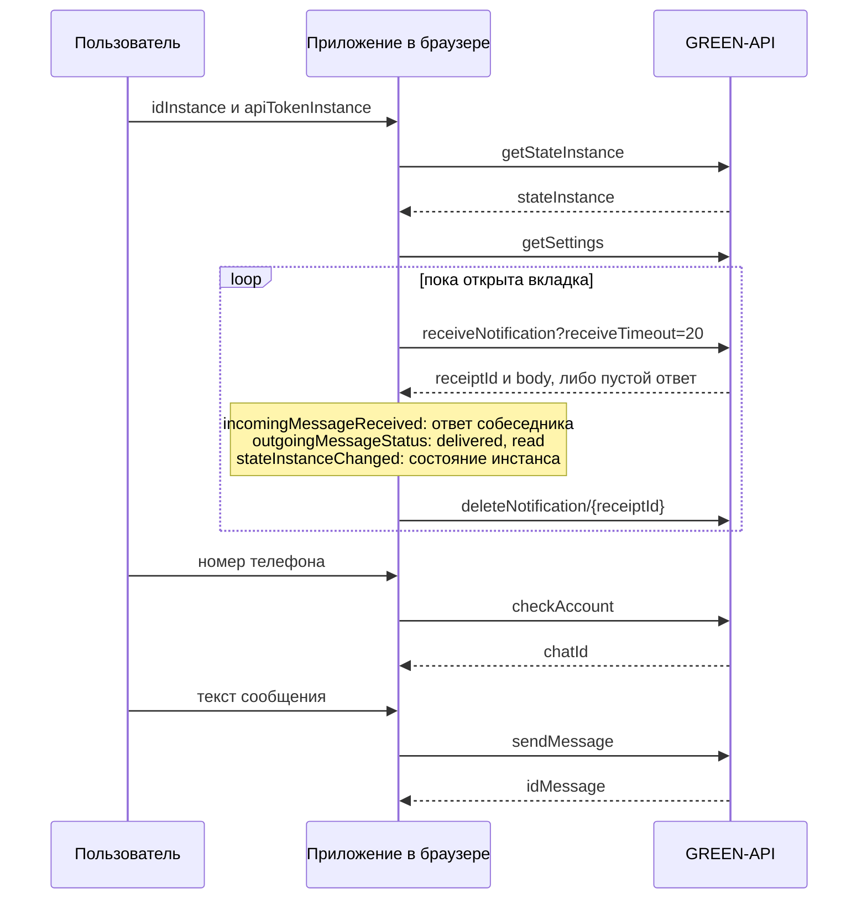

# Чат для MAX на GREEN-API

Веб-чат для мессенджера MAX на React. Принимает и отправляет текстовые сообщения через GREEN-API: отправка методом [SendMessage](https://green-api.com/v3/docs/api/sending/SendMessage/), получение через [HTTP API](https://green-api.com/v3/docs/api/receiving/technology-http-api/) (ReceiveNotification и DeleteNotification). Внешний вид повторяет web.max.ru. Тестовое задание на позицию «Фронтенд разработчик React».

[](https://github.com/interhub/green-api-max-chat/actions/workflows/ci.yml)

- Сервис в интернете: https://personal-info.ru/green-api-max-chat/
- Скриншоты: [docs/screenshots](docs/screenshots)
- Видео: [docs/demo.mp4](docs/demo.mp4)





## Что умеет

- Вход по idInstance и apiTokenInstance из личного кабинета GREEN-API.
- Новый чат по номеру телефона получателя. Номер проверяется методом checkAccount, из ответа берётся chatId.
- Отправка и получение текстовых сообщений. Сообщение появляется сразу, галочки показывают статус: отправляется, отправлено, доставлено, прочитано. Неотправленное сообщение можно отправить повторно.
- Приём сообщений в реальном времени (long polling), счётчики непрочитанных, число непрочитанных в заголовке вкладки.
- История чатов хранится в браузере и переживает перезагрузку страницы.
- Светлая и тёмная темы, раскладка для телефона.
- Подсказки по состоянию инстанса: не авторизован, запускается, выключены уведомления. Уведомления включаются кнопкой в самом чате.
- Понятные ошибки для ограничений тарифа Developer: 3 чата, лимит проверок номеров.

## Запуск локально

Нужен Node.js 22.13 или новее (подходит и 24).

```bash
git clone https://github.com/interhub/green-api-max-chat.git
cd green-api-max-chat
npm install
npm run dev
```

Откройте адрес из вывода команды (обычно http://localhost:5173) и введите idInstance и apiTokenInstance.

### Где взять idInstance и apiTokenInstance

1. Зарегистрируйтесь в [личном кабинете GREEN-API](https://console.green-api.com).
2. Создайте инстанс MAX с тарифом Developer (бесплатный).
3. Авторизуйте инстанс: в приложении MAX откройте «Профиль», «Устройства», «Войти по QR-коду» и отсканируйте код из кабинета. На время входа по QR пароль входа в MAX нужно отключить.
4. Скопируйте idInstance и apiTokenInstance со страницы инстанса.

После входа приложение проверит настройки инстанса. Если приём сообщений выключен, в чате появится кнопка «Включить». Она вызывает setSettings: инстанс перезапустится, настройки применяются до 5 минут. Те же настройки можно включить в кабинете вручную: поле webhookUrl остаётся пустым, включены все уведомления (о входящих и исходящих сообщениях, статусах доставки и состоянии инстанса). Без уведомлений о статусах не появятся галочки «доставлено» и «прочитано».

### Без реального инстанса

В репозитории есть эмулятор GREEN-API. Он повторяет формат ответов из документации: адреса методов, очередь уведомлений, коды ошибок, лимит тарифа Developer.

```bash
npm run dev:mock
```

Команда запускает эмулятор на порту 8787 и приложение, настроенное на него. Данные для входа: idInstance `3100000001`, apiTokenInstance `mock-token`. Любой номер России или Беларуси, кроме оканчивающихся на `0000`, считается номером с аккаунтом MAX.

Чтобы собеседник отвечал сам, запустите `MOCK_AUTOREPLY=1 npm run dev:mock`. Ответ от имени собеседника можно отправить и вручную:

```bash
curl -X POST http://localhost:8787/__mock/incoming \
  -H 'Content-Type: application/json' \
  -d '{"chatId":"<chatId из http://localhost:8787/__mock/log>","text":"Привет!"}'
```

## Как это устроено



Решения, которые стоит знать:

- Запросы идут из браузера напрямую в GREEN-API: у сервиса открыт CORS, собственный сервер не нужен. Приложение отправляет только заголовок Content-Type, остальные заголовки блокирует предварительный запрос браузера.
- Адрес API определяется по idInstance: `https://<первые 4 цифры>.api.green-api.com`, для номеров на 3 дополнительно `https://3100.api.green-api.com` (хост MAX из документации), запасной вариант `https://api.green-api.com`. Если ни один не подошёл, экран входа сам открывает поле «API URL»: туда вставляется адрес из личного кабинета. Адрес можно задать и переменной `VITE_GREEN_API_URL`.
- В MAX chatId не равен номеру телефона. Номер превращается в chatId методом checkAccount. Результат запоминается, повторные проверки не делаются: на тарифе Developer их всего 100 в месяц. Поддерживаются номера России (+7) и Беларуси (+375).
- Приём построен на long polling с receiveTimeout 20 секунд. Уведомление удаляется после обработки, повторная доставка того же receiptId не создаёт дубликатов, сообщения различаются по idMessage. При ошибках паузы растут: 1, 2, 4, 8 и до 15 секунд, а пока связь не восстановилась, запросы идут с receiveTimeout 5 секунд, чтобы сообщение «Нет связи» исчезло сразу после восстановления. Ответы 401 и 403 завершают сессию.
- Отправленное сообщение появляется сразу со статусом «отправляется». Когда приходит уведомление outgoingAPIMessageReceived, оно сливается с этим сообщением и дублей нет, в каком бы порядке ни пришли ответ и уведомление.
- Состояние хранится в useReducer и контексте без внешних библиотек. История чатов лежит в localStorage отдельно для каждого idInstance (до 500 сообщений в чате).
- Сообщения не из текста (фото, документы и другое) показываются подписью с типом.

## Структура

```
src/
  api/          клиент GREEN-API, определение адреса, разбор уведомлений
  state/        редьюсер, провайдеры сессии и чатов, цикл приёма уведомлений
  lib/          номера телефонов, localStorage
  components/   экраны и части интерфейса
  ui/           кнопки, аватар, форматирование дат, ссылки
  theme/        светлая и тёмная темы
  test/         общие помощники тестов
mock/           эмулятор GREEN-API
e2e/            сценарии Playwright
```

## Проверки

```bash
npm run lint
npm run typecheck
npm test            # модульные тесты и тесты компонентов, Vitest
npm run test:mock   # тесты эмулятора
npm run test:e2e    # сценарии в браузере, нужен установленный Google Chrome
```

Тесты и e2e работают на эмуляторе GREEN-API (e2e поднимают его на порту 8788, а приложение на 5199; порты меняются переменными `E2E_MOCK_PORT` и `E2E_APP_PORT`). CI на GitHub Actions запускает всё перечисленное, собирает Docker-образ и публикует приложение на GitHub Pages.

## Сборка и публикация

```bash
npm run build       # результат в dist/
```

Docker:

```bash
docker build -t green-api-max-chat .
docker run --rm -p 8080:80 green-api-max-chat
```

GitHub Pages: в настройках репозитория выберите Settings, Pages, Source: GitHub Actions. Публикация идёт из workflow `CI` после успешных проверок на ветке main.

## Ограничения

- Только текст. Вложения, реакции и редактирование не поддерживаются.
- Тариф Developer: общение только с 3 чатами на инстанс и 100 проверок номеров в месяц.
- Чат с номером можно начать только для России и Беларуси: так работает checkAccount.
- Токен хранится в браузере: в sessionStorage до закрытия вкладки или в localStorage, если включено «Запомнить меня».
- Один инстанс стоит держать открытым в одной вкладке: очередь уведомлений делится между вкладками.

## Лицензия

MIT
